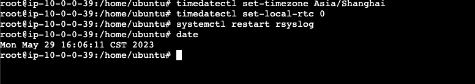
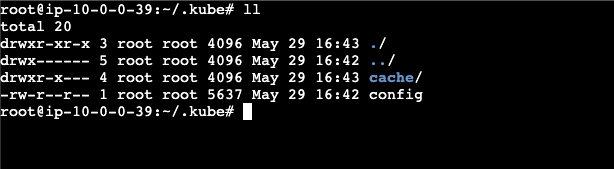
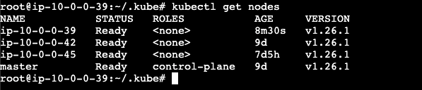

# Kubernates安装

> 基于 **Ubuntu 20.04** 版本安装Kubernates
>
> 能访问外网最好哈


## 一、基础环境搭建

#### 1、设置时区

```shell
# 设置系统时区为 中国/上海
timedatectl set-timezone Asia/Shanghai
# 将当前的 UTC 时间写入硬件时钟
timedatectl set-local-rtc 0
# 重启依赖于系统时间的服务
systemctl restart rsyslog
# 查看时间
date
```



#### 2、设置国内源

> 有梯子的可以跳过此步骤

 备份默认源

```shell
sudo cp /etc/apt/sources.list /etc/apt/sources.list.bak
sudo rm -rf /etc/apt/sources.list
```


配置国内源

```shell
 sudo vi /etc/apt/sources.list
 # 添加以下内容
 deb http://mirrors.aliyun.com/ubuntu/ jammy main restricted universe multiverse
 deb-src http://mirrors.aliyun.com/ubuntu/ jammy main restricted universe multiverse
 deb http://mirrors.aliyun.com/ubuntu/ jammy-security main restricted universe multiverse
 deb-src http://mirrors.aliyun.com/ubuntu/ jammy-security main restricted universe multiverse
 deb http://mirrors.aliyun.com/ubuntu/ jammy-updates main restricted universe multiverse
 deb-src http://mirrors.aliyun.com/ubuntu/ jammy-updates main restricted universe multiverse
 deb http://mirrors.aliyun.com/ubuntu/ jammy-proposed main restricted universe multiverse
 deb-src http://mirrors.aliyun.com/ubuntu/ jammy-proposed main restricted universe multiverse
 deb http://mirrors.aliyun.com/ubuntu/ jammy-backports main restricted universe multiverse
 deb-src http://mirrors.aliyun.com/ubuntu/ jammy-backports main restricted universe multiverse

# 更新配置
 sudo apt-get update
 sudo apt-get upgrade
```


#### 3、禁用 selinux

> 默认ubuntu下没有这个模块，centos下需要禁用selinux；

#### 4、禁用swap

```shell
 # 临时禁用
 sudo swapoff -a
 # 永久禁用
  sudo vi /etc/fstab
# 注释最后一行
 #/swap.img      none    swap    sw      0       0

```

#### 5、修改内核参数

```shell
vi /etc/modules-load.d/containerd.conf
# 添加以下参数
overlay
br_netfilter
# 使其生效
sudo modprobe overlay
sudo modprobe br_netfilter


vi /etc/sysctl.d/kubernetes.conf
# 添加以下参数
net.bridge.bridge-nf-call-ip6tables = 1
net.bridge.bridge-nf-call-iptables = 1
net.ipv4.ip_forward = 1

# 使其生效
sudo sysctl --system
```


#### 6、安装Docker Engine

> 新版本的Kubernates已经放弃使用docker，改用containerd

卸载旧版本

```shell
# 卸载旧版本
sudo apt-get remove docker docker-engine docker.io containerd runc
# 更新apt
sudo apt-get update
# 安装相关插件
sudo apt-get install ca-certificates curl gnupg lsb-release
```


添加官方`GPG key`

```shell
sudo mkdir -m 0755 -p /etc/apt/keyrings
curl -fsSL https://download.docker.com/linux/ubuntu/gpg | sudo gpg --dearmor -o /etc/apt/keyrings/docker.gpg

# 配置repository
echo "deb [arch=$(dpkg --print-architecture) signed-by=/etc/apt/keyrings/docker.gpg] https://download.docker.com/linux/ubuntu $(lsb_release -cs) stable" | sudo tee /etc/apt/sources.list.d/docker.list > /dev/null

# 更新apt
sudo apt-get update
```

安装docker

```shell
# 安装
sudo apt-get install docker-ce docker-ce-cli containerd.io docker-buildx-plugin docker-compose-plugin
# 设置开机自启动
sudo systemctl enable docker.service
# 重启
sudo systemctl restart docker.service

```

配置阿里云镜像

> 外网的不需要配置哈
>
> 阿里云地址：[cr.console.aliyun.com/cn-hangzhou…](https://link.juejin.cn/?target=https%3A%2F%2Fcr.console.aliyun.com%2Fcn-hangzhou%2Finstances%2Fmirrors)


修改containerd配置

> 新版本使用这个containerd

备份默认配置

```
sudo mv /etc/containerd/config.toml /etc/containerd/config.toml.bak
sudo vi /etc/containerd/config.toml
```

配置内容如下：

```shell
disabled_plugins = []
imports = []
oom_score = 0
plugin_dir = ""
required_plugins = []
root = "/var/lib/containerd"
state = "/run/containerd"
temp = ""
version = 2

[cgroup]
 path = ""

[debug]
 address = ""
 format = ""
 gid = 0
 level = ""
 uid = 0

[grpc]
 address = "/run/containerd/containerd.sock"
 gid = 0
 max_recv_message_size = 16777216
 max_send_message_size = 16777216
 tcp_address = ""
 tcp_tls_ca = ""
 tcp_tls_cert = ""
 tcp_tls_key = ""
 uid = 0

[metrics]
 address = ""
 grpc_histogram = false

[plugins]

 [plugins."io.containerd.gc.v1.scheduler"]
  deletion_threshold = 0
  mutation_threshold = 100
  pause_threshold = 0.02
  schedule_delay = "0s"
  startup_delay = "100ms"

 [plugins."io.containerd.grpc.v1.cri"]
  device_ownership_from_security_context = false
  disable_apparmor = false
  disable_cgroup = false
  disable_hugetlb_controller = true
  disable_proc_mount = false
  disable_tcp_service = true
  enable_selinux = false
  enable_tls_streaming = false
  enable_unprivileged_icmp = false
  enable_unprivileged_ports = false
  ignore_image_defined_volumes = false
  max_concurrent_downloads = 3
  max_container_log_line_size = 16384
  netns_mounts_under_state_dir = false
  restrict_oom_score_adj = false
  sandbox_image = "registry.aliyuncs.com/google_containers/pause:3.9"
  selinux_category_range = 1024
  stats_collect_period = 10
  stream_idle_timeout = "4h0m0s"
  stream_server_address = "127.0.0.1"
  stream_server_port = "0"
  systemd_cgroup = false
  tolerate_missing_hugetlb_controller = true
  unset_seccomp_profile = ""

  [plugins."io.containerd.grpc.v1.cri".cni]
   bin_dir = "/opt/cni/bin"
   conf_dir = "/etc/cni/net.d"
   conf_template = ""
   ip_pref = ""
   max_conf_num = 1

  [plugins."io.containerd.grpc.v1.cri".containerd]
   default_runtime_name = "runc"
   disable_snapshot_annotations = true
   discard_unpacked_layers = false
   ignore_rdt_not_enabled_errors = false
   no_pivot = false
   snapshotter = "overlayfs"

   [plugins."io.containerd.grpc.v1.cri".containerd.default_runtime]
    base_runtime_spec = ""
    cni_conf_dir = ""
    cni_max_conf_num = 0
    container_annotations = []
    pod_annotations = []
    privileged_without_host_devices = false
    runtime_engine = ""
    runtime_path = ""
    runtime_root = ""
    runtime_type = ""

    [plugins."io.containerd.grpc.v1.cri".containerd.default_runtime.options]

   [plugins."io.containerd.grpc.v1.cri".containerd.runtimes]

    [plugins."io.containerd.grpc.v1.cri".containerd.runtimes.runc]
     base_runtime_spec = ""
     cni_conf_dir = ""
     cni_max_conf_num = 0
     container_annotations = []
     pod_annotations = []
     privileged_without_host_devices = false
     runtime_engine = ""
     runtime_path = ""
     runtime_root = ""
     runtime_type = "io.containerd.runc.v2"

     [plugins."io.containerd.grpc.v1.cri".containerd.runtimes.runc.options]
      BinaryName = ""
      CriuImagePath = ""
      CriuPath = ""
      CriuWorkPath = ""
      IoGid = 0
      IoUid = 0
      NoNewKeyring = false
      NoPivotRoot = false
      Root = ""
      ShimCgroup = ""
      SystemdCgroup = true

   [plugins."io.containerd.grpc.v1.cri".containerd.untrusted_workload_runtime]
    base_runtime_spec = ""
    cni_conf_dir = ""
    cni_max_conf_num = 0
    container_annotations = []
    pod_annotations = []
    privileged_without_host_devices = false
    runtime_engine = ""
    runtime_path = ""
    runtime_root = ""
    runtime_type = ""

    [plugins."io.containerd.grpc.v1.cri".containerd.untrusted_workload_runtime.options]

  [plugins."io.containerd.grpc.v1.cri".image_decryption]
   key_model = "node"

  [plugins."io.containerd.grpc.v1.cri".registry]
   config_path = ""
[plugins."io.containerd.grpc.v1.cri".registry.mirrors."52.74.16.184:8081"]
endpoint = ["http://52.74.16.184:8081"]

   [plugins."io.containerd.grpc.v1.cri".registry.auths]

   [plugins."io.containerd.grpc.v1.cri".registry.configs]
[plugins."io.containerd.grpc.v1.cri".registry.configs."52.74.16.184:8081".tls]
insecure_skip_verify = true
[plugins."io.containerd.grpc.v1.cri".registry.configs."52.74.16.184:8081".auth]
username = "adminn"
password = "Harbor12345"
   [plugins."io.containerd.grpc.v1.cri".registry.headers]

   [plugins."io.containerd.grpc.v1.cri".registry.mirrors]

  [plugins."io.containerd.grpc.v1.cri".x509_key_pair_streaming]
   tls_cert_file = ""
   tls_key_file = ""

 [plugins."io.containerd.internal.v1.opt"]
  path = "/opt/containerd"

 [plugins."io.containerd.internal.v1.restart"]
  interval = "10s"

 [plugins."io.containerd.internal.v1.tracing"]
  sampling_ratio = 1.0
  service_name = "containerd"

 [plugins."io.containerd.metadata.v1.bolt"]
  content_sharing_policy = "shared"

 [plugins."io.containerd.monitor.v1.cgroups"]
  no_prometheus = false

 [plugins."io.containerd.runtime.v1.linux"]
  no_shim = false
  runtime = "runc"
  runtime_root = ""
  shim = "containerd-shim"
  shim_debug = false

 [plugins."io.containerd.runtime.v2.task"]
  platforms = ["linux/amd64"]
  sched_core = false

 [plugins."io.containerd.service.v1.diff-service"]
  default = ["walking"]

 [plugins."io.containerd.service.v1.tasks-service"]
  rdt_config_file = ""

 [plugins."io.containerd.snapshotter.v1.aufs"]
  root_path = ""

 [plugins."io.containerd.snapshotter.v1.btrfs"]
  root_path = ""

 [plugins."io.containerd.snapshotter.v1.devmapper"]
  async_remove = false
  base_image_size = ""
  discard_blocks = false
  fs_options = ""
  fs_type = ""
  pool_name = ""
  root_path = ""

 [plugins."io.containerd.snapshotter.v1.native"]
  root_path = ""

 [plugins."io.containerd.snapshotter.v1.overlayfs"]
  root_path = ""
  upperdir_label = false

 [plugins."io.containerd.snapshotter.v1.zfs"]
  root_path = ""

 [plugins."io.containerd.tracing.processor.v1.otlp"]
  endpoint = ""
  insecure = false
  protocol = ""

[proxy_plugins]

[stream_processors]

 [stream_processors."io.containerd.ocicrypt.decoder.v1.tar"]
  accepts = ["application/vnd.oci.image.layer.v1.tar+encrypted"]
  args = ["--decryption-keys-path", "/etc/containerd/ocicrypt/keys"]
  env = ["OCICRYPT_KEYPROVIDER_CONFIG=/etc/containerd/ocicrypt/ocicrypt_keyprovider.conf"]
  path = "ctd-decoder"
  returns = "application/vnd.oci.image.layer.v1.tar"

 [stream_processors."io.containerd.ocicrypt.decoder.v1.tar.gzip"]
  accepts = ["application/vnd.oci.image.layer.v1.tar+gzip+encrypted"]
  args = ["--decryption-keys-path", "/etc/containerd/ocicrypt/keys"]
  env = ["OCICRYPT_KEYPROVIDER_CONFIG=/etc/containerd/ocicrypt/ocicrypt_keyprovider.conf"]
  path = "ctd-decoder"
  returns = "application/vnd.oci.image.layer.v1.tar+gzip"

[timeouts]
 "io.containerd.timeout.bolt.open" = "0s"
 "io.containerd.timeout.shim.cleanup" = "5s"
 "io.containerd.timeout.shim.load" = "5s"
 "io.containerd.timeout.shim.shutdown" = "3s"
 "io.containerd.timeout.task.state" = "2s"

[ttrpc]
 address = ""
 gid = 0
 uid = 0
```

⭐️⭐️ containerd需要配置私服仓库 需要修改上面的文件

```shell

  [plugins."io.containerd.grpc.v1.cri".registry]
   config_path = ""
   # 新增的配置
[plugins."io.containerd.grpc.v1.cri".registry.mirrors."52.74.16.184:8081"]
endpoint = ["http://52.74.16.184:8081"]

   [plugins."io.containerd.grpc.v1.cri".registry.auths]

   [plugins."io.containerd.grpc.v1.cri".registry.configs]
   # 新增的配置
[plugins."io.containerd.grpc.v1.cri".registry.configs."52.74.16.184:8081".tls]
insecure_skip_verify = true
[plugins."io.containerd.grpc.v1.cri".registry.configs."52.74.16.184:8081".auth]
username = "adminn"
password = "Harbor12345"

```


```
# 开机自启
sudo systemctl enable containerd
# 重启
sudo systemctl daemon-reload && systemctl restart containerd

```


## 二、安装k8s 组件

#### 1、添加阿里云的源

> 可以访问外网的可以跳过

```
curl -s https://mirrors.aliyun.com/kubernetes/apt/doc/apt-key.gpg | sudo apt-key add -
sudo apt-add-repository "deb https://mirrors.aliyun.com/kubernetes/apt/ kubernetes-xenial main"
sudo apt-get update
```


#### 2、安装指定版本组件

```shell
sudo apt update
sudo apt install -y kubelet=1.26.1-00 kubeadm=1.26.1-00 kubectl=1.26.1-00
sudo apt-mark hold kubelet kubeadm kubectl

```


#### 3、下载Kubernates镜像

配置k8s镜像列表

```shell
sudo kubeadm config images list --kubernetes-version=v1.26.1
# 下载镜像
sudo docker pull registry.cn-hangzhou.aliyuncs.com/google_containers/kube-apiserver:v1.26.1
sudo docker pull registry.cn-hangzhou.aliyuncs.com/google_containers/kube-controller-manager:v1.26.1
sudo docker pull registry.cn-hangzhou.aliyuncs.com/google_containers/kube-scheduler:v1.26.1
sudo docker pull registry.cn-hangzhou.aliyuncs.com/google_containers/kube-proxy:v1.26.1
sudo docker pull registry.cn-hangzhou.aliyuncs.com/google_containers/pause:3.9
sudo docker pull registry.cn-hangzhou.aliyuncs.com/google_containers/etcd:3.5.6-0
sudo docker pull registry.cn-hangzhou.aliyuncs.com/google_containers/coredns:v1.9.3
```


----

> 以上是master节点和node节点都需要操作的

----

> 以下是master节点单独操作


## 三、配置master节点


重新生成token

```shell
kubeadm token create --print-join-command

```


## 四、加入master节点

#### 1、复制config

> 复制master主机上的.kube/config 的文件



#### 2、加入master

```shell
kubeadm join 10.0.0.46:6443 --token 861fmt.ga16j8ub0e1zw69h --discovery-token-ca-cert-hash sha256:2fbf566dc2edbdcfa857cac42be3c1561e5b281091aa29bb88fb80c510cbb698 
```


#### 3、查看node状态


```shell
kubectl get nodes
```



> 以上就加入成功了
