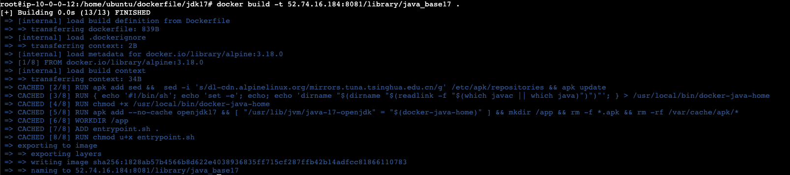
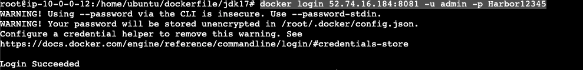
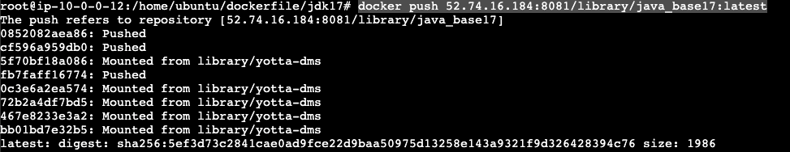

# 基础镜像创建

> 自己新建一个非常小的基镜像，使用的是alpine:3.18.0 作为基础镜像


## JDK17版本

#### 1、创建基础镜像模板

```shell
FROM alpine:3.18.0
RUN apk add sed &&  sed -i 's/dl-cdn.alpinelinux.org/mirrors.tuna.tsinghua.edu.cn/g' /etc/apk/repositories && apk update 
RUN { echo '#!/bin/sh'; echo 'set -e'; echo; echo 'dirname "$(dirname "$(readlink -f "$(which javac || which java)")")"'; } > /usr/local/bin/docker-java-home
RUN chmod +x /usr/local/bin/docker-java-home
ENV LANG=zh_CN.UTF-8
ENV LANGUAGE=zh_CN.UTF-8
ENV JAVA_HOME=/usr/lib/jvm/java-17-openjdk
ENV PATH=/usr/local/sbin:/usr/local/bin:/usr/sbin:/usr/bin:/sbin:/bin:/usr/lib/jvm/java-17-openjdk/jre/bin:/usr/lib/jvm/java-17-openjdk/bin
RUN apk add --no-cache openjdk17 && [ "$JAVA_HOME" = "$(docker-java-home)" ] && mkdir /app && rm -f *.apk && rm -rf /var/cache/apk/*
WORKDIR /app
ADD entrypoint.sh .
RUN chmod u+x entrypoint.sh 
CMD ["sh","/app/entrypoint.sh"]
```


#### 2、entrypoint.sh脚本

```shell
#!/bin/sh
exec java -jar app.jar
```


#### 3、docker build镜像

执行下面的命令

```shell
docker build -t 52.74.16.184:8081/library/java_base17 .
```

执行成功的截图




#### 4、推送到私服上

> 推送到私服上供其他的java项目使用

**登录私服**

```shell
docker login 52.74.16.184:8081 -u admin -p Harbor12345
```

执行成功的截图



**push到harbor**

```shell
docker push 52.74.16.184:8081/library/java_base17:latest
```

执行成功的截图


