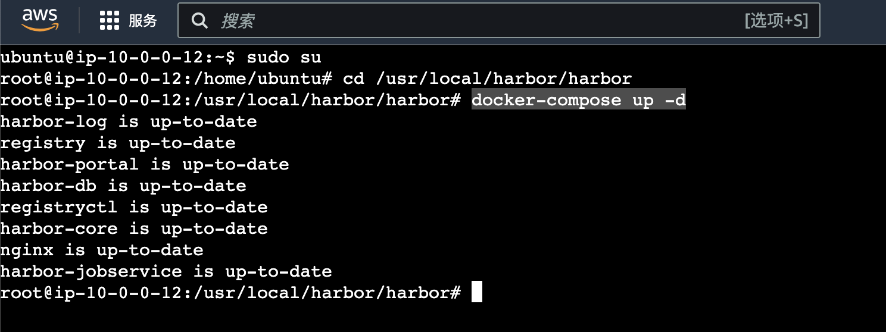
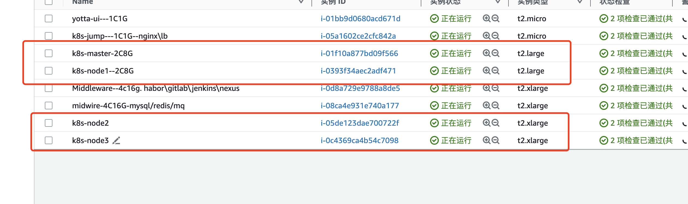

# 服务器开关机运维

> 目前买的服务器都是按量收费的，为了节约资金，所以目前每天都会手动开、关机。
>
> 开机一般是上班时间早上九点半左右，关机时间看最后使用者的时间，没人用了，下班就会关机

## 1、关机操作

登录到aws中，在新加坡区找到ec2，后续实例会越来越多	


勾选要关机的实例，目前就yotta-ui这台服务器不关机，其他的都关机

随意右键点击要关机的实例ID，然后点击**停止实例**，记得是**停止，停止，停止**

> 📢📢📢 谁要是点了终止实例，自己去剖腹自尽吧


## 2、开机操作

> ***先开中间件和CI工具的服务器，需要启动下harbor，因为有时候部分启动不起来***
>
> ***然后在开Kubernates集群，因为Kubernates依赖这些中间件***

### 2.1 启动中间件

> 主要是harbor需要手动确认，其他的都是自动启动的

**找到下面两台服务器，勾选上，点击右键 启动现有实例**


> 然后等待开机挖鼻，显示正在运行就表示开机成功了。


进入下面这台服务器里面，然后连接实例，进入实例里面


**执行以下命令：**

```shell
# 切换到root用户
 sudo su

# 进入到harbor安装目录
cd /usr/local/harbor/harbor
# 启动harbor
docker-compose up -d
```

启动完成的样子，所有的containerd都是up-to-date的状态




### 2.2 启动Kubernates集群

> 记得四台一起选上 然后执行启动现有实例

直接选中所有的Kubernates的机器 右键启动就好

下面这四台都启动成功就ok



