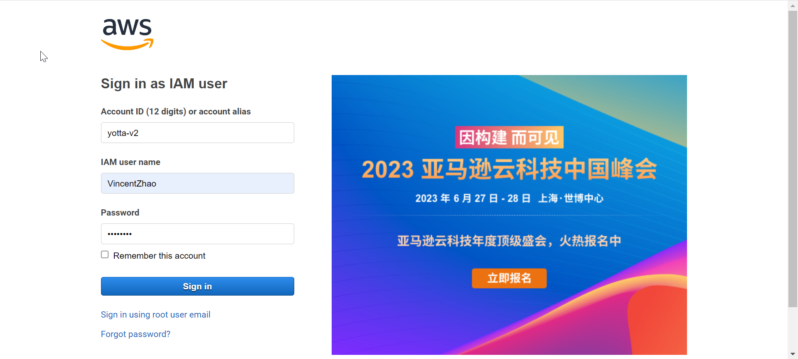
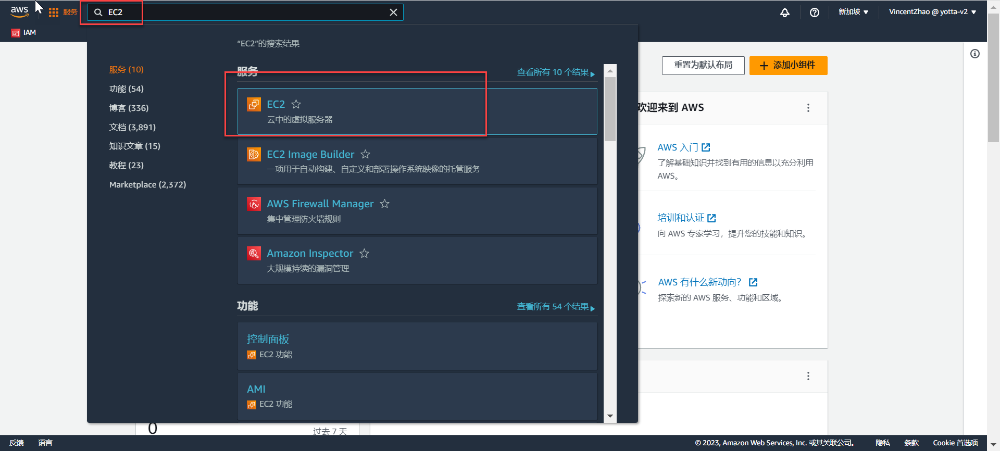
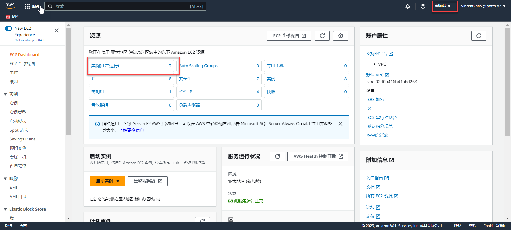
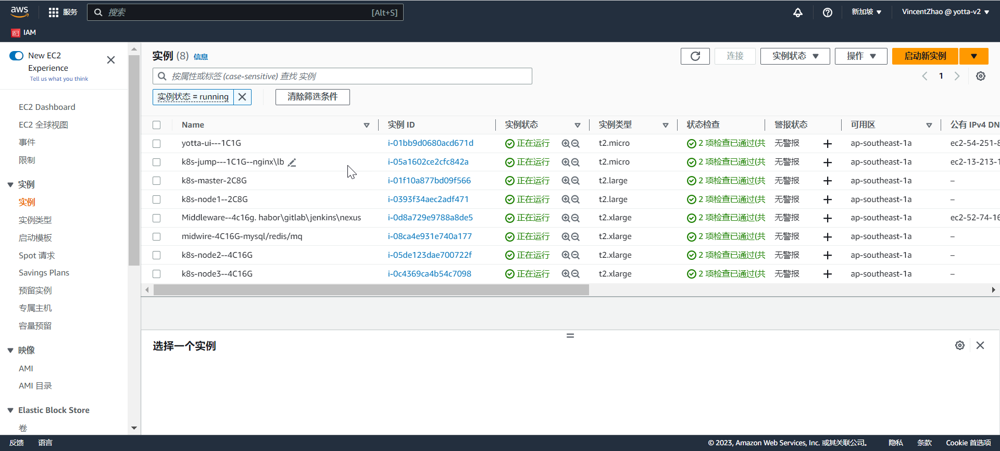

# 登录AWS服务器

* 登录地址: https://yotta-v2.signin.aws.amazon.com/console

* 使用自己的用户密码登录，如没有账号，请联系管理员进行添加。
* 进入主页面，左上角搜索框中输入"EC2",在查询列表中选择"EC2"服务。

* 进入到EC2的管理界面，注意右上角的地区，要选择"新加坡"，因为我们的服务器在这个区域。
* 这里就可以看到所有的EC2的列表。

