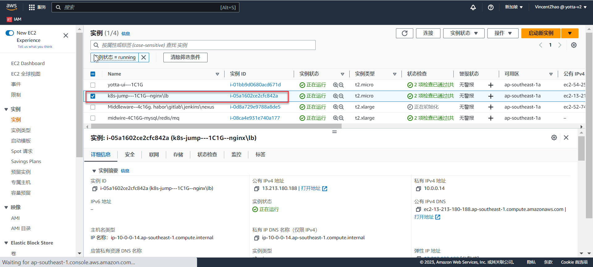
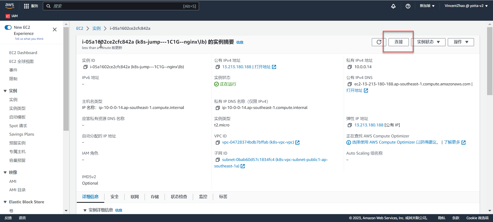
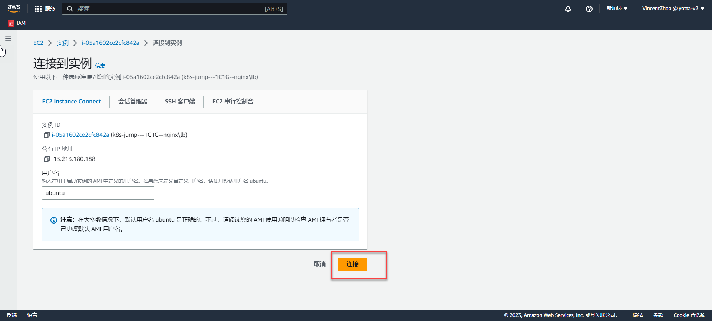

# 4.0 查看服务器k8s日志(通过console)

## 注意通过控制台访问AWS服务器只能用个人电脑，公司电脑有墙无法连接。

* 选择jump-server(跳板机)，点击"实例ID"中的链接，进入到实例详情页面


* 进入到跳板机的实例详情页面，右上角点击"连接", 进入连接页面


* 配置不用调整，连接


* 进入控制台，顺序输入如下命令
```
ssh -i "Singapore-ec2.pem" ubuntu@10.0.0.46
sudo su
```
* 之后即可正常操作kubectl命令了。