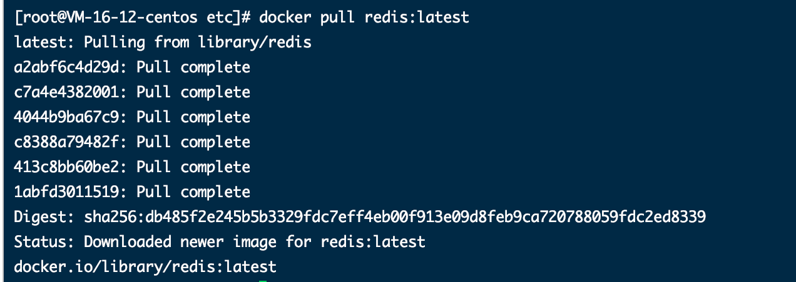

# 安装基础环境

> 基于docker安装 Gitlab、Redis、Mysql、Nexus

## 1、Docker安装

```shell
# 切换镜像源头  增加镜像源
[root@master ~]# yum-config-manager --add-repo https://mirrors.aliyun.com/docker-ce/linux/centos/docker-ce.repo
```


```shell

# 查看当前镜像源中支持的docker版本
[root@master ~]# yum list docker-ce --showduplicates
```


```shell

# 安装指定版本的 docker-ce  不指定版本 默认最新版本
# 必须指定  --setopt=obsoletes=0  否则yum会自动安装更高的版本
[root@master ~]# yum install --setopt=obsoletes=0 docker-ce-18.06.0.ce-3.el7 -y
```


```shell
# 添加配置文件
# Docker在默认情况下使用的Cgroup Driver 为cgroupfs 而kubernates 推荐使用systemd来代替cgroupfs
[root@node2 ~]# mkdir /etc/docker

cat > /etc/docker/daemon.json <<EOF
{
"exec-opts": ["native.cgroupdriver=systemd"],
"registry-mirrors": ["https://kn0t2bca.mirror.aliyuncs.com"]
}
EOF
```


```shell
# 启动docker
[root@master ~]# systemctl restart docker
[root@master ~]# systemctl enable docker
[root@master ~]# docker version
```


**Docker安装完毕**


## 2、Gitlab安装

> 基于docker安装gitlab

```shell
# 下载镜像
  docker pull gitlab/gitlab-ce
```


```shell
# 创建容器
docker run -d -p 8001:80 -p 8002:443 -p 8003:22 --restart always --name gitlab -v /docker/gitlab/etc/gitlab:/etc/gitlab -v /docker/gitlab/var/log/gitlab:/var/log/gitlab -v /docker/gitlab/var/opt/gitlab:/var/opt/gitlab --privileged=true gitlab/gitlab-ce

```


```shell
# 修改gitlab.rb文件
vi /docker/gitlab/etc/gitlab/gitlab.rb


# 如果使用公有云且配置了域名了，可以直接设置为域名，如下
external_url 'http://gitlab.xxxx.com'
# 如果没有域名，则直接使用宿主机的ip，如下
external_url 'http://43.142.181.163'

# 同样如果有域名，这里也可以直接使用域名
gitlab_rails['gitlab_ssh_host'] =  'gitlab.redrosee2100.com'
# 同样如果没有域名，则直接使用宿主机的ip地址
gitlab_rails['gitlab_ssh_host'] = '43.142.181.163'

# 设置时区为东八区，即北京时间
gitlab_rails['time_zone'] = 'Asia/Shanghai'  

# 端口为启动docker时映射的ssh端口
gitlab_rails['gitlab_shell_ssh_port'] =8003 
# 设置超时时间
  unicorn['worker_timeout'] = 90

```


```shell
# 重启镜像
docker restart gitlab

# 进入docker容器里
docker exec -it gitlab bash

# 修改端口号
  vi /opt/gitlab/embedded/service/gitlab-rails/config/gitlab.yml

```


```shell
# 重启镜像
gitlab-ctl restart
```


```shell
# 查看默认密码
cat /docker/gitlab/etc/gitlab/initial_root_password

Password: rqMtBm/2IT0gjGWBWJhPgCU5negmYrei8dPSVuvyM+Q=
```


```shell
# 账号密码登录
  root/rqMtBm/2IT0gjGWBWJhPgCU5negmYrei8dPSVuvyM+Q=

```


## 3、Redis 安装

> 基于docker安装
>
> 参考地址：https://www.runoob.com/docker/docker-install-redis.html
>

```shell
# 拉取最新的镜像
  docker pull redis:latest
```




```shell
# 安装服务
docker run -d --name myredis -p 6379:6379 redis --requirepass "0ca5db3e15b84acf941"
```


> 本地工具连接


## 4、安装Mysql

> 基于docker安装mysql
>
> 参考地址：https://www.runoob.com/docker/docker-install-mysql.html

```shell
# 拉取镜像
 docker pull mysql:latest
```


```shell
 # 启动镜像 目前装的是5.7 因为系统强制处理
docker run --name mysql5.7 -e MYSQL_ROOT_PASSWORD=35503059a8314f499a -p 3307:3306 -d mysql:5.7
```


执行flyway的时候 发现对mysql5.7的要求很高

1. mysql的max_allowed_packet设置过小

   > com.mysql.jdbc.PacketTooBigException: Packet for query is too large (4232009 > 4194304). You can change this value on the server by setting the max_allowed_packet’ variable.
   >
   > 解决方案参考：https://blog.csdn.net/weixin_39643007/article/details/106135162

   

2. 需要对表名大小写 进行忽略

   > Ubuntu  docker mysql 就是 yum 命令集
   >
   > Centos 里面 docker mysql 就是apt命令集
   >
   > 且需要手动安装 vi或者vim
   >
   > 然后再my.conf 文件中添加  lower_case_table_names = 1

   

   

## 5、安装Nexus

> 基于docker 安装
>
> 参考地址：https://github.com/sonatype/docker-nexus3
>
> 文件没有做挂载，数据都存在宿主机上

```shell
# 拉取镜像
docker pull  sonatype/nexus3
```


```shell
# To run, binding the exposed port 8081 to the host, use:
docker run -d -p 8091:8081 --name nexus sonatype/nexus3	
```

```shell
# When stopping, be sure to allow sufficient time for the databases to fully shut down.
docker stop --time=120 nexus


# 进入容器
docker exec -it nexus bash
# 查看默认密码
cat /nexus-data/admin.password 
76bf2152-404f-4b16-a9bd-c864f783b689

```


**登录主页面**

> http://nexus.yotta.ink
>
> 账号：admin  密码：76bf2152-404f-4b16-a9bd-c864f783b689


### Persistent Data

> 官方提供的持久化数据，目前直接挂载宿主机上

There are two general approaches to handling persistent storage requirements with Docker. See [Managing Data in Containers](https://docs.docker.com/engine/tutorials/dockervolumes/) for additional information.

1.*Use a docker volume*. Since docker volumes are persistent, a volume can be created specifically for this purpose. This is the recommended approach.

```shell
$ docker volume create --name nexus-data
$ docker run -d -p 8081:8081 --name nexus -v nexus-data:/nexus-data sonatype/nexus3
```

2.*Mount a host directory as the volume*. This is not portable, as it relies on the directory existing with correct permissions on the host. However it can be useful in certain situations where this volume needs to be assigned to certain specific underlying storage.

```shell
$ mkdir /some/dir/nexus-data && chown -R 200 /some/dir/nexus-data
$ docker run -d -p 8081:8081 --name nexus -v /some/dir/nexus-data:/nexus-data sonatype/nexus3
```


## 6、安装RockerMq

> 基于docker 安装
>
> 参考地址：https://blog.csdn.net/ming19951224/article/details/109063041

拉取镜像

```shell
docker pull rocketmqinc/rocketmq
```

创建存储路径

```shell
mkdir -p /etc/docker/rocketmq/data/mq/logs  /etc/docker/rocketmq/data/mq/store
```

安装 MQ

```shell
docker run -d \
--restart=always \
--name mq \
-p 9876:9876 \
-v /etc/docker/rocketmq/data/mq/logs:/root/logs \
-v /etc/docker/rocketmq/data/mq/store:/root/store \
-e "MAX_POSSIBLE_HEAP=100000000" \
rocketmqinc/rocketmq \
sh mq 
```

安装MQ Blocker

```shell
docker run -d  \
--restart=always \
--name rmqbroker \
--link rmqnamesrv:namesrv \
-p 10911:10911 \
-p 10909:10909 \
-v  /docker/rocketmq/data/broker/logs:/root/logs \
-v  /docker/rocketmq/data/broker/store:/root/store \
-v /docker/rocketmq/conf/broker.conf:/opt/rocketmq-4.4.0/conf/broker.conf \
-e "NAMESRV_ADDR=namesrv:9876" \
-e "MAX_POSSIBLE_HEAP=200000000" \
rocketmqinc/rocketmq \
sh mqbroker -c /opt/rocketmq-4.4.0/conf/broker.conf 
```

安装MQ console

> http://mq.yotta.ink
>
> 控制台 ，解决infra脚本创建topic和group 的问题

```shell
docker run -d \
--restart=always \
--name rmqadmin \
-e "JAVA_OPTS=-Drocketmq.namesrv.addr=54.222.214.88:9876 \
-Dcom.rocketmq.sendMessageWithVIPChannel=false" \
-p 9999:8080 \
pangliang/rocketmq-console-ng
```


## 7、安装Harbor

> 本地手动安装harbor，使用离线版本安装
>
> 官网地址：https://goharbor.io/docs/2.0.0/install-config/download-installer/
>
> 参考：https://www.cnblogs.com/young-q/p/16462210.html

上传tag 包到服务器上

```shell
scp  -i "kube.pem"  /download/harbor-offline-installer-v2.7.2.tgz ubuntu@ec2-54-222-214-88.cn-north-1.compute.amazonaws.com.cn:~
```

解压tag包

```shell
tar -zxf harbor-offline-installer-v2.7.2.tgz
```

复制、修改配置文件

```shell
# 复制并重命名一份新的配置文件
cp harbor.yml.tmpl harbor.yml
vim harbor.yml  # 或者使用 vi harbor.yml 编辑
```

修改内容

```yaml
# Configuration file of Harbor

# The IP address or hostname to access admin UI and registry service.
# DO NOT use localhost or 127.0.0.1, because Harbor needs to be accessed by external clients.
# 绑定的IP
hostname: 54.222.214.88

# http related config
http:
  # port for http, default is 80. If https enabled, this port will redirect to https port
  # 启动的端口号
  port: 8088

# 不使用HTTPS 
# https related config
# https:
  # https port for harbor, default is 443
  # port: 443
  # The path of cert and key files for nginx
  # certificate: /your/certificate/path
  # private_key: /your/private/key/path
```

安装harbor

```shell
./install.sh
```


> 等到安装完毕

启动命令：

```shell
# 进入到harbor安装目录
docker-compose up -d
```

关闭命令：

```shell
# 进入到harbor安装目录
docker-compose down
```

登录控制台

> http://harbor.yotta.ink
>
> **账号：admin     密码：Harbor12345**


k8s 使用私服的镜像仓库的时候，需要时https的请求，所以修改docker配置 改成私有的 

找到docker 的 `daemon.json` 配置文件，CentOS 7 的路径：`/etc/docker/daemon.json`（系统版本不同所处位置不同，其他版本的请自行百度），如果路径下没有这个文件自己**创建**即可。然后再配置文件里加上：

```json
{
  // docker 镜像下载地址
  "registry-mirrors": ["https://mirror.ccs.tencentyun.com"],
   // 不安全的镜像仓库（此处配置Harbor 的地址+端口号）
   "insecure-registries": ["54.222.214.88:8088"],
}
```

```shell
# 修改完成后reload配置文件
sudo systemctl daemon-reload
 
# 重启docker服务
sudo systemctl restart docker.service
```


开启docker 2375端口

> 因为需要对外暴露服务

```shell
# 查看docker配置位置
systemctl status docker.service
```

> 切记 ，下面这个才是真正的位置


修改配置文件

```shell
ExecStart=/usr/bin/dockerd  -H tcp://0.0.0.0:2375 -H unix://var/run/docker.sock
```

重启服务

```shell
systemctl daemon-reload
systemctl restart docker.service
```

重看是否暴露成功

```
netstat -nlpt |grep 2375
```


## 8、安装Jenkins

> 因为用的的是Ubuntu的系统，所以直接在官网上找对应的安装教程
>
> 一定要用官网 官网地址 官网没有任何问题
>
> https://pkg.jenkins.io/debian-stable/

```shell
docker pull jenkins/jenkins
```

登录页面

地址 http://jenkins.yotta.ink

获取admin密码

**admin/JackGao5210**

```shell
vi /data/jenkins_home/secrets/initialAdminPassword
# 密码
cd048723676c44c68268da9a5828f172
```


admin/b49e0dc7e4784cfa841f8671e634098d

http://54.223.20.224:8090/

node 节点密码  b49e0dc7e4784cfa841f8671e634098d

客服电话：10100866


## 9、安装nacos

> 基于压缩包安装的 
>
> 参考文档：https://nacos.io/zh-cn/docs/v2/quickstart/quick-start.html
>
> 安装位置为：10.0.0.38中间件服务器上

修改数据库配置

```shell
	root@ip-10-0-0-38:/home/ubuntu/nacos/conf# vi /home/ubuntu/nacos/conf/application.properties
	
```

改成线上mysql数据库地址

```properties
### Count of DB:
 db.num=1
### Connect URL of DB:
 db.url.0=jdbc:mysql://localhost:3307/nacos?characterEncoding=utf8&connectTimeout=1000&socketTimeout=3000&autoReconnect=true&useUnicode=true&useSSL=false&sererTimezone=UTC
 db.user.0=root
 db.password.0=35503059a8314f499a
```

设置开机自动，新增service配置

```shell
root@ip-10-0-0-38:/home/ubuntu/nacos/conf# vi /lib/systemd/system/nacos.service
```

新增脚本

```shell
[Unit]
Description=nacos
After=network.target

[Service]
Environment="JAVA_HOME=/usr/lib/jvm/java-8-openjdk-amd64"
Type=forking
ExecStart=/home/ubuntu/nacos/bin/startup.sh -m standalone
ExecReload=/home/ubuntu/nacos/bin/shutdown.sh
ExecStop=/home/ubuntu/nacos/bin/shutdown.sh
PrivateTmp=true

[Install]
WantedBy=multi-user.target
```

 设置开机自启动

```shell
root@ip-10-0-0-38:/home/ubuntu/nacos/conf# systemctl enable nacos.service
```

查看状态

```shell
root@ip-10-0-0-38:/home/ubuntu/nacos/conf# systemctl status nacos
● nacos.service - nacos
     Loaded: loaded (/lib/systemd/system/nacos.service; enabled; vendor preset: enabled)
     Active: active (running) since Sun 2023-05-21 05:57:46 UTC; 1h 17min ago
    Process: 9901 ExecStart=/home/ubuntu/nacos/bin/startup.sh -m standalone (code=exited, status=0/SUCCESS)
   Main PID: 9923 (java)
      Tasks: 216 (limit: 19180)
     Memory: 702.4M
        CPU: 1min 31.305s
     CGroup: /system.slice/nacos.service
             └─9923 /usr/lib/jvm/java-8-openjdk-amd64/bin/java -Djava.ext.dirs=/usr/lib/jvm/java-8-openjdk-amd64/jre/lib/ext:/usr/lib/jvm/java-8-openjdk-amd6>
```


mysql 10.0.0.38   3306 root/35503059a8314f499a
redis 10.0.0.38   6379 0ca5db3e15b84acf941
mq    10.0.0.38   9876


## 10、安装MongoDB

> 基于docker安装

1、拉取镜像

```shell
docker pull mongo
```


2、创建外部挂载文件夹

```shell
mkdir -p /etc/docker/mongodb/data
```


3、启动容器

```
docker run -itd --name mongo -v /etc/docker/mongodb/data:/data/db -p 27017:27017 mongo:latest --auth
```


4、进入容器创建密码

> 5.0以上版本使用mongosh

```shell
docker exec -it mongo mongosh admin
```


创建账号密码

```shell
## 创建
db.createUser({ user:'root',pwd:'123456',roles:[ { role:'userAdminAnyDatabase', db: 'admin'},'readWriteAnyDatabase']});
## 登录
db.auth('root', '123456')
```


